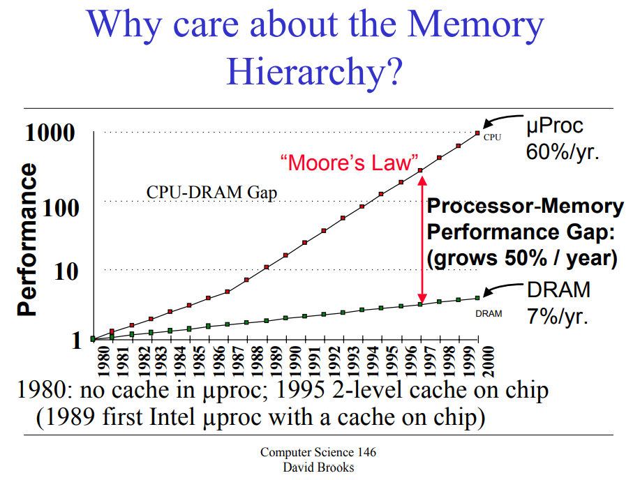
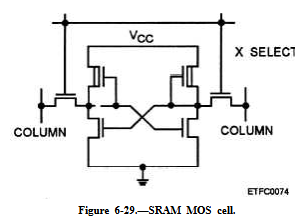
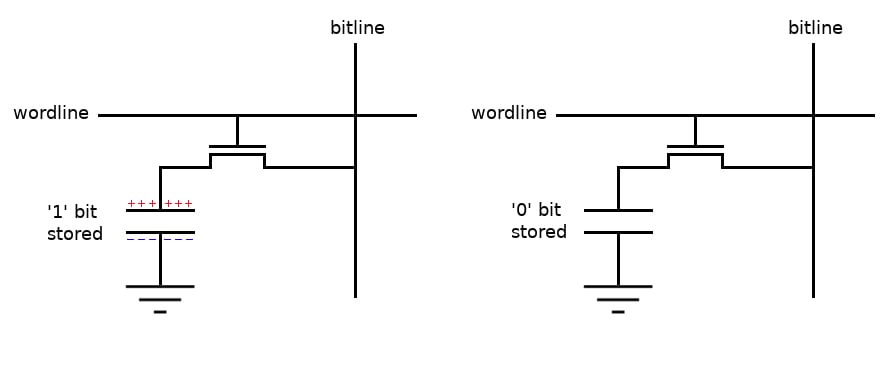

# Cache Memory와 Memory Hierarchy

현대 컴퓨터에서 CPU와 메모리 사이의 성능 격차를 해결하기 위한 Cache 시스템 정리

---

## 1. Memory Hierarchy 개요

### 왜 Cache가 필요한가?
CPU는 클럭이 늘어날수록 처리속도가 개선되지만, 메모리가 이동하는 것은 전자기파가 광속을 넘을수가 없기때문에 물리적인 부분에서 개선이 어려움

**CPU-DRAM 성능 격차**
- CPU: 60%/년 성능 향상
- DRAM: 7%/년 성능 향상
- 매년 50%씩 격차 증가

### Memory Hierarchy 구조

```
Register (1ns, 2KB)      ← SRAM
  ↓
L1 Cache (4ns, 64KB)     ← SRAM
  ↓
L2 Cache (10ns, 8MB)     ← SRAM
  ↓
L3 Cache (20ns, 64MB)    ← SRAM
  ↓
Memory (50ns, 4GB)       ← DRAM
  ↓
Disk (10ms, 1TB)
```
자세히 보면 SRAM이 캐시로 많이 쓰이는걸 확인 가능한데 그 이유가
1. 속도가 DRAM대비 빠르다
2. 리프레시가 존재하지않기 때문에 Refresh 시간동안 접근이 불가능한 문제가 없음
3. 데이터의 무결성을 유지하기가 쉽다. (즉 커패시터보다 데이터 누수에 대한 관리가 쉬움)


---

## 2. SRAM vs DRAM

### SRAM (Static RAM)


**특징:**
- Mosfet 6개로 이루어진 구조로 되어있음
- 전원이 공급되는한 데이터는 영구적으로 유지
- 1byte를 이루기 위해서 6개의 transister가 필요하기 때문에 Dram 대비 많은 면적이 필요함

### DRAM (Dynamic RAM)


**특징:**
- Mosfet 1개, capacitor 1개로 이루어진 구조로 되어있음
- 커패시터가 상시 방전 되기 때문에 지속적으로 refresh를 해줘야 함
- 면적이 sram대비 적게 차지하기 때문에 용량대비 집적도가 높다.


---

## 3. Locality (지역성)

### Spatial Locality (공간적 지역성)

특정 주소를 참조하고 있으면 근처에 있는 주소의 값도 곧 참조 된다는것을 의미함.
즉 아래 예시를 A[i]가 참조되고 있으면 곧 A[i+1]이 참조될 예정

**예시:**
```c
j=val1;
k=val2;
For (i=0; i<10000;i++) {
A[i] += j;
B[i] += k;}
```

### Temporal Locality (시간적 지역성)

**정의:**
- 최근에 참조 된 데이터는 다시 참조될 가능성이 높다는것을 의미함.
아래의 예시를 보면 j에 대해서 선언을 했으면 곧 접근할 가능성이 높음

**예시:**
```c
j=val1;
k=val2;
For (i=0; i<10000;i++) {
A[i] += j;
B[i] += k;}
```

---

## 4. Cache 기본 용어

### Block (Line)

**정의:**
- 캐시와 메모리 사이에서 데이터를 주고받는 최소 단위
- 즉 캐시는 데이터를 가져올때 일정 단위로 가져오게 설계가 되어있음


### Hit vs Miss

**Hit:**
- 특정 레벨의 블록에서 데이터를 찾을 case

**Miss:**
- 특정 레벨의 블록에서 데이터를 찾지 못하는 case

### 성능 지표

**AMAT (Average Memory Access Time)**
```
AMAT = Hit Time + Miss Rate × Miss Penalty
```

---


## 5. Cache 구조

### Cache Line 구성

```
┌───────┬──────┬──────────────┐
│ Valid │ Tag  │    Data      │
└───────┴──────┴──────────────┘
```

**각 필드 설명:**
- Valid bit: 이 캐시 라인에 유효한 데이터가 있는지 표시 (1=유효, 0=비어있음). 전원 켜지면 모두 0으로 초기화됨
- Tag: 메모리 주소의 상위 비트를 저장. 같은 인덱스에 매핑되는 여러 주소를 구분하기 위한 식별자
- Data: 실제 데이터 블록 (보통 64바이트). 메모리에서 통째로 가져온 데이터 뭉치

### 메모리 주소 분해

```
32비트 주소: [Tag | Index | Offset]
```

**예시:**
- **Offset (하위 6비트)**: 64바이트 블록 내에서 정확히 어느 바이트인지 (2^6 = 64)
- **Index (중간 비트)**: 캐시의 어느 라인으로 갈지 결정. 캐시 라인이 1024개면 10비트 필요
- **Tag (상위 비트)**: 나머지 비트. 같은 인덱스에 매핑되는 서로 다른 주소를 구분

---

## 6. Cache 동작 원리

### Hit 판단 과정

1. **Index 추출**: 메모리 주소에서 Index 비트를 뽑아서 캐시의 해당 라인으로 이동
2. **Valid 확인**: 해당 라인의 Valid bit가 1인지 확인. 0이면 무조건 Cache Miss
3. **Tag 비교**: Valid=1이면, 저장된 Tag와 주소의 Tag 비트를 비교. 일치하면 Cache Hit!
4. **Data 읽기**: Hit이면 Data 필드에서 Offset으로 정확한 바이트 꺼내서 CPU에 전달

### 구체적 예시

```
주소 0x12345678의 Cache 접근 (64바이트 블록, 1024라인 캐시 가정):
1. Index 추출: 주소의 bit[15:6] = 0x15A → 캐시 라인 346번으로 이동
2. Valid 확인: 라인 346의 Valid bit = 1 → 데이터 있음
3. Tag 비교: 라인 346의 Tag(0x48D1) == 주소의 bit[31:16](0x1234)? → 불일치 → Cache Miss!
4. 메모리에서 0x12345640~0x1234567F를 가져와서 라인 346에 저장 후 CPU에 전달
```

---

## 7. Latency vs Bandwidth

### Latency (지연 시간)

**정의:**
- 데이터 요청 보낸 시점부터 첫 번째 데이터가 도착할 때까지 걸리는 시간 (단위: ns)
- "얼마나 빨리 시작하냐"의 문제

**한계:**
- 물리적 거리 (빛의 속도): 신호가 1ns에 약 30cm 이동. DRAM이 20cm 떨어져 있으면 왕복만 1.3ns
- 회로 지연: 트랜지스터 스위칭, 신호 증폭, row buffer 로딩 시간
- 프로토콜 오버헤드: command-address-data 순차 전송

### Bandwidth (대역폭)

**정의:**
- 단위 시간당 전송할 수 있는 데이터 양 (단위: GB/s)
- "한 번에 얼마나 많이 보내냐"의 문제

**개선 방법:**
- 버스 폭 넓히기: 64비트 → 128비트 → 256비트 데이터 버스
- 클럭 속도 높이기: DDR5는 클럭 양쪽 엣지에서 데이터 전송 (Double Data Rate)
- 병렬 채널: 듀얼/쿼드 채널 메모리로 동시에 여러 경로로 데이터 전송
- Prefetching: 미리 예측해서 데이터를 가져와 파이프라인 채움


### 비교

| 특성 | Latency | Bandwidth |
|------|---------|-----------|
| 개선 난이도 | 어려움 (물리 법칙) | 상대적 쉬움 ($$) |
| 해결책 | (내용 작성) | (내용 작성) |


---

## 참고 자료

- [Harvard CS146 Lecture 14](https://www.eecs.harvard.edu/cs146-246/cs146-lecture14.pdf)
- [all about circiut](https://www.allaboutcircuits.com/news/dram-sram-flash-and-a-new-form-of-nvram-whats-the-difference/)
- [electronicstechnician](https://electronicstechnician.tpub.com/14091/css/Figure-6-29-Sram-Mos-Cell-159.htm)

- (추가 자료)


