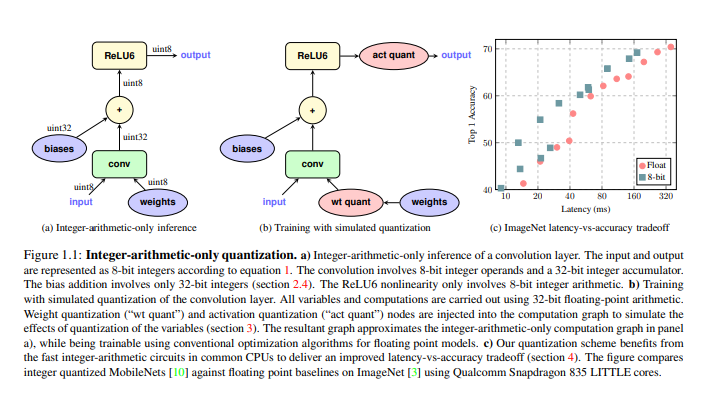

# 1. 양자화
양자화는 부동 소수점 구현 FP32로 구현된 모델에서 낮은 정밀도 int8과 같은 정수형으로 변경해서 연산 및 메모리 접근을 하는 방법을 의미함
- FP32 (32bit) 대비 int8(8bit) 로 변경하게 되면 모델크기가 75% 줄어듬
- 동일한 throughput 대비 많은 가중치를 한번에 업데이트가 가능함
- pytorch 에서는 quantized tensor를 지원하여 양자화가 가능

# 2. 양자화의 종류
## 2.1 Dynamic quantization
가중치를 양자화하여 용량을 줄이는것은 동일하지만 추론단계에서 차이점이 있음. 각 레이어 마다 입력되는 변수의 범위를 계산하여 양자화된 가중치를 역 양자화를 하여 forward 연산을 수행함.   
- 동적 양자화의 중요한점은 incoming floating-point activations 을 확인하고 나서 min/max가 결정나고 나서 역 양자화가 중요한 부분임
- 모델에 저장된 가중치의 값을 그대로 쓰는게 아니라 별도의 변환과정이 필요함
- 실제로 모델이 진행되는 과정을 보면 가중치의 저장만 int8과 같이 작은 자료형으로 저장되지 실제 연산에서는 FP16 혹은 FP32로 이루어져 있음

## 2.2 Static quantization
Static 방식은 입력으로 들어오는 변수의 범위가 고정되어있다고 가정하고 가중치를 고정하는 방법. 

- 정적 양자화는 역 양자화 과정을 없애기 위해서 사용함.
- 특정 하드웨어 연산기에 맞춰서 추론속도를 높이는것이 목표
- 해당 방법을 진행하기 위해서는 별도의 calibration 데이터 셋을 통해서 PQT가 필요

## 2.3 QAT

각 레이어 사이에 양자화 레이어를 추가해서 모델을 순전파하여 입력을 주고 역전파에서는 별도의 양자화 없이 fake quantize에 맞춰서 각 변수에 대한 양자화 값을 학습하는 방법

- 3가지 방법중 가장 정확도가 높음
- 하지만 데이터 셋이 많이 필요하다는 점과 과적합의 위험이 있는점이 문제점임

# 3. 아키텍쳐별 양자화 기법 

| 모델 유형 | 선호하는 방식 | 왜 |
| --- | --- | --- |
| **LSTM/RNN** | 동적 양자화 | 가중치 계산에 있어 처리량은 컴퓨팅/메모리 대역폭에 의해 좌우됩니다. |
| **BERT/Transformer** | 동적 양자화 | 가중치 계산에 있어 처리량은 컴퓨팅/메모리 대역폭에 의해 좌우됩니다. attention 연산을 위한 내적과정에서 값이 커지는 문제 때문에 동적 방식이 유리함|
| **CNN** | 정적 양자화 | 활성화에 필요한 처리량은 메모리 대역폭에 의해 제한됩니다. |
| **CNN** | 양자화 인식 훈련 (QAT) | 정적 양자화로 정확도를 얻을 수 없는 경우 |

참고 자료
1. https://arxiv.org/pdf/1712.05877
2. https://pytorch.org/blog/introduction-to-quantization-on-pytorch/

